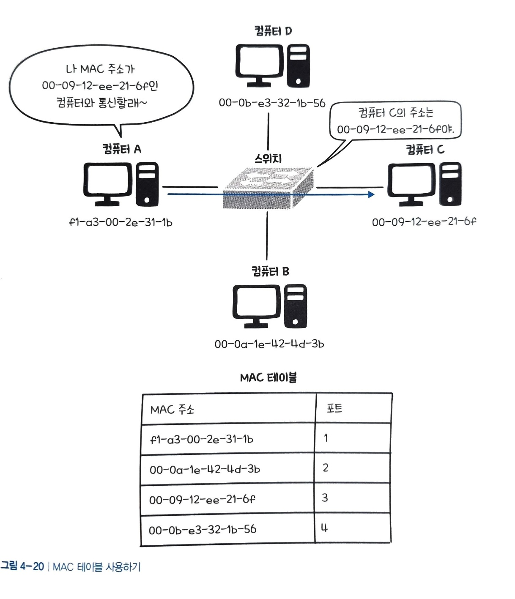
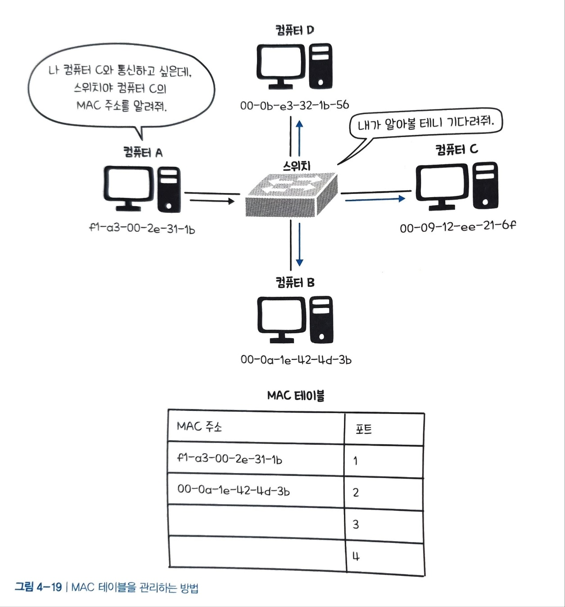

# 네트워크 - 데이터 링크 계층

## 데이터 링크 계층의 역할

네트워크에서 데이터를 관리하고 전달하는 계층으로, **신뢰성**과 **효율성**에 중요한 역할을 한다. `데이터 링크 계층`은 데이터를 작은 프레임 단위로 분할하고, MAC 주소를 활용하여 장비를 식별한다.

하지만, 여러 기기가 동시에 데이터를 전송하려고 하면 여러 데이터가 충돌하여 제대로 전달되지 않으므로, `데이터 링크 계층`은 **오류를 탐지하거나 수정하는 역할**과 데이터의 원활한 흐름과 네트워크 매체에서 충돌 관리도 수행한다.

데이터 링크 계층에서 오류를 감지하거나 수정하는 방식은 `회선 제어`, `오류 제어`, `흐름 제어`가 있다.
###  회선 제어
`회선 제어`는 **오류를 감지하기보다는 회피하는 방법**으로 신호 간 충돌 현상이 발생하지 않도록 제어한다.

그러기 위해서 신호의 시작을 의미하는 **ENQ**와 끝을 의미하는 **EOT**를 명시적으로 지정한다. 
수신자는 송신자로부터 신호를 받으면  '응 잘받았어'라는 의미의 **ACK**를 송신자에게 보내서 신호를 정상적으로 수신하였음을 알려준다.

### 오류 제어
`오류 제어`는 데이터가 외부 간섭, 시간 지연 등에 의해 데이터가 변형되거나 순서가 어긋나는 등의 통신 장애가 발생하지 않도록 **오류를 검출하고 정정하여 통신에 대한 신뢰성을 확보하는 방법**이다.

- `패리티 검사`는 수신자에게 보내는 최종 데이터의 1의 개수를 **짝수 개로 보낼지 홀수 개로 보낼지 송 수신자가 미리 약속**하고 여분의 비트를 채워 보내는 방법이다. 1을 제외한 나머지는 0을 채워 보낸다.
- `CRC`는 데이터에 `CRC 코드`를 추가하여 오류를 감지하는 방법으로, 송신자가 `CRC 코드`를 생성하고 수신자 측에서도 동일한 계산을 수행하여 일치 여부를 확인한다.
- `검사합`은 데이터의 각 바이트 값을 더하거나 연산하여 생성되는 값이다. 송신자가 데이터와 관련된 검사합을 계산하고, 수신자 측에서도 동일한 계산을 수행한다. 
- `해밍코드`는 데이터에 추가적인 패리티 비트를 포함시키고, 이 패리티 코드를 분석하여 오류를 식별 및 정정한다.

### 흐름 제어
`흐름제어`는 송신자와 수신자의 데이터 속도 차이를 해결하기 위해 수신자 상황에 따라 송신자의 데이터 전송량을 조정한다.
**정지 - 대기**방법이 사용된다.

## 이더넷
`이더넷`이란 **다수의 컴퓨터,허브,스위치 등을 하나의 인터넷 케이블에 연결한 네트워크 구조**이다.

이더넷은  2대 이상의 컴퓨터가 동시에 데이터(프레임)를 보내려고 하는 상황인 `충돌`을 방지하기 위해 `CSMA/CD`라고 하는 프로토콜을 사용하는데, 이를 통해 **이더넷에서는 전류의 강도를 확인해 케이블이 사용 중인지 확인하여** 충돌을 방지한다.

즉, 송신 전에 케이블이 사용 가능한지 확인하고, 사용 가능하면 데이터를 전송한다. 또한 전송 후에도 여전히 발생할 수 있는 충돌을 확인하는 것이 `CSMA/CD 방식`이다.

현재는 OSI 2계층에 해당하는 스위치 장비가 그 역할을 대신하므로 잘 사용하지 않는 기술이다.

이더넷은 `MAC 주소`를 이용하여 컴퓨터 간 통신을 한다.

## MAC 주소
`MAC 주소`는 **랜 카드에 할당된 값이며 전 세계에서 하나밖에 존재하지 않는 고유한 값**이다.

`MAC 주소`는 48비트로 표현되며, 상위 24비트는 `OUI`라고 해서 랜 카드 제조사에 부여된 코드이며, 이후 24비트는 `UAA`로 제조사가 랜카드에 부여한 고유 번호이다.

2계층에서 `MAC 주소`를 헤더에 넣어 프레임을 생성하고, 이때 헤더에 추가되는 송신자와 수신자의 `MAC 주소`가 함께 프레임에 추가된다.
즉, 수신자의 `MAC 주소`에 대한 정보도 획득이 필요하다.

또한 `유형`이라는 정보도 추가되는데, 이것은 프로토콜을 나타낸다.
프로토콜의 종류에는 현재 우리가 사용하는 32비트의 일반적인 주소인 `IPv4`, IPv4의 주소 부족 문제를 해결하기 위해 등장한 128비트의 IP주소인 `IPv6`가 있고, IP주소와 MAC주소를 매핑해주는 `ARP` 프로토콜이 있다.

**상대방의 MAC주소를 알기 위해 사용하는 프로토콜**이 `ARP` 프로토콜이며, `ARP(Address Resolution Protocol)`는 **IP 주소와 MAC 주소를 매핑하기 위한 프로토콜**이다.

**ARP를 이용해서 MAC주소를 알아내는 과정**
- 모든 컴퓨터에게 수신자의 MAC주소를 질의하며, 이를 `브로드캐스트`라고 한다. 또한, **MAC주소를 묻는 것**을 `ARP 요청`이라고 한다.

- 그럼 모든 컴퓨터는 요청한 IP와 자신의 IP를 비교하며, 응답한 컴퓨터는 **MAC 주소를 전달**한다. 이를 `ARP 응답` 이라고 한다. 
- 이후 **전달 받은 MAC주소를 메모리에 저장**하는데 이것을 `ARP 테이블`이다. 앞으로 통신 시 자신의 `ARP 테이블`을 먼저 참조한다.

MAC 주소 확인은 **랜 환경 내에서만 가능**하고, 왠 환경에서 확인해야 할 시, **라우터 장비를 거쳐야만 확인이 가능**하다.

## 스위치의 구조
**스위치는 소규모 네트워크 안에서 컴퓨터, 프린터 등 모든 장치를 서로 연결해서 데이터를 쉽게 공유할 수 있도록 하는 장비이다.**

이를 위해서 스위치는 여러 개의 포트로 구성되어 있다.

### 스위치에서 MAC 테이블 관리하기
스위치는 허브와 같이 컴퓨터와 프린터 등을 연결하여 데이터를 공유하는 것 말고도, 또 다른 기능이 있는데, 바로 포트에 연결된 컴퓨터의 MAC 주소를 관리하는 것이다.

그림과 같이 '1번 포트의 MAC 주소는 무엇이다' 라는 형태의 테이블(표)로 관리하는데, 이것을 `MAC 테이블`이라고 한다.

스위치가 MAC테이블에 필요한 컴퓨터의 MAC 주소를 추가하는 방법은 다음과 같다.
- 컴퓨터 A는 C와 통신을 시도한다.

- 스위치는 자신의 MAC 테이블에 컴퓨터 C의 MAC 주소가 없다는 것을 확인한다. 이 후 컴퓨터 A가 보낸 데이터를 컴퓨터 B,C,D에게 보낸다.  **스위치에 물려 있는 모든 컴퓨터에 데이터를 보내는 것을 `플러딩`이라고 한다.**

-  컴퓨터 B,C,D가 스위치에 응답하면서 자신의 MAC 주소를 알려준다. 스위치는 이렇게 받은 MAC주소를 MAC테이블에 업데이트한다.
- 이제 스위치는 컴퓨터 C의 MAC주소를 A에게 알려줌으로써, 2대의 컴퓨터가 서로 통신할 수 있다.

이를 통해 만일 컴퓨터 A가 컴퓨터 C에 데이터를 보낼 때,

- A는 만일 자신의 `ARP 테이블`에 상대 컴퓨터의 MAC주소가 없으면 스위치에 질의를 한다.

-  업데이트 된 MAC테이블에서 C의 주소를 A에게 전달을 하면, A와 C의 통신이 가능해지므로, 다른 컴퓨터에게 질의가 전달되지 않는다. 이를, `MAC 주소 필터링`이라고 한다. 

## 전송 방향에 따른 통신 방식
**단방향 통신**: 선로가 하나만 있어서 일방 통행만 가능하다.
네트워크에서는 이 선로를 `채널`이라고 한다.

### 양방향 통신
하나의 통신 채널에서 송수신이 모두 가능한 방식이며, 반이중 방식과 전이중 방식이 있다.

#### 반이중 방식

`반이중 방식`은  양쪽 방향에서 통신 가능하지만 동시에 통신이 불가능하다. 송신과 수신을 번갈아가면서 하기에 속도는 빨라졌지만, 충돌 문제는 여전히 남아있다. 

`충돌 도메인`은 충돌이 발생할 때 영향이 미치는 범위를 뜻하는데, 하나의 허브에 컴퓨터들이 연결되어 있다면, 여기에 연결된 모든 컴퓨터가 `충돌도메인`이 된다.

`반이중 방식`은 양방향 통신이 가능하지만, 동시 통신이 불가능하기에 충돌 현상을 피할 수 없다.

#### 전이중 방식
동시 통신이 불가능하기에 충돌 현상을 피할 수 없는 단점을 극복하기 위해 등장한 것이 `전이중 방식` 이다.

**`전이중 방식`은 채널을 2개 두어서 양쪽 방향에서 동시에 데이터를 주고 받을 수 있는 방식이며 스위치에서 사용된다.**