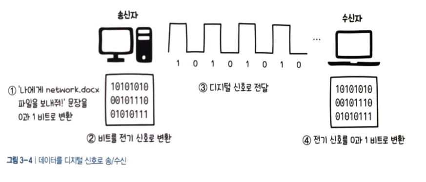
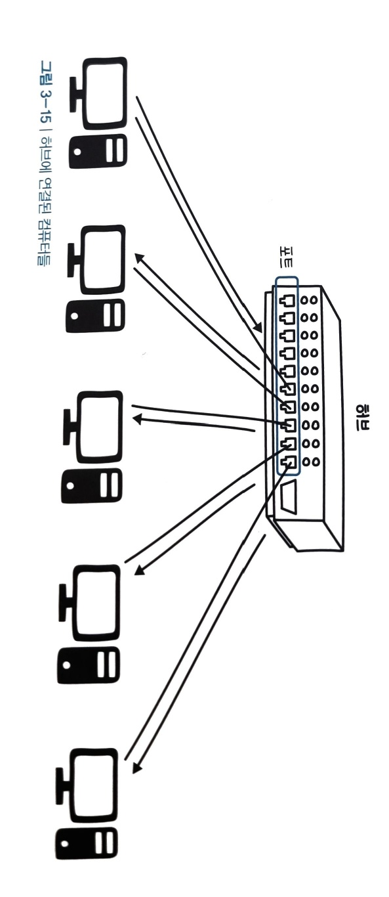

# 네트워크 - 물리 계층

## 물리계층의 역할
OSI 계층에서 최하위에 위치한 `물리 계층`은 **컴퓨터를 물리적으로 연결하거나 데이터를 전기 신호로 변환하고 제어하는 역할**을 담당한다.

> 전기 신호는 전압이 일정한 패턴으로 변하여 생기는 일련의 흐름이다. 
즉, 전압의 변화에 의한 신호를 말한다.

- `아날로그 신호`는 빛, 소리 등과 같이 연속적으로 변하는 물결 모양의 신호로 주로 유선전화나 라디오방송에 사용된다.
- `디지털 신호`는 **특정한 값을 기준으로 불연속적으로 변하는 막대모양의 신호**이다.

우리는 주로 디지털 신호를 사용한다. 
`비트`란 컴퓨터가 데이터를 처리하는 최소 단위로서 0과 1로 구성된다. 

데이터를 디지털 신호로 송/수신하는 과정은 다음과 같다.

- 먼저 문장을 0과 1의 비트로 변환한다.
- 해당 비트를 전기 신호로 변환한다.
- 수신자에게 (디지털 신호로) 전달한다.
- 수신자 측에서는 전기 신호가 다시 0과 1로 변환된다.

근데 '나에게 network.docx파일을 보내줘'라는 메시지는 어떻게 그리고 어디서 전기 신호로 변환되는걸까?

이 역할을 하는 것이 `랜카드(LAN Card)`라는 장치이다.

2대 이상의 컴퓨터가 통신하기 위해 랜이라는 네트워크 환경이 필요하다고 했다.
**랜 카드는 내 컴퓨터와 인터넷을 연결하는 필수 장치**이다.
랜 카드는 데이터가 내 컴퓨터 밖으로 나가는 출발점이다.

## 케이블의 종류와 구조
랜카드가 0과 1의 비트를 전기 신호로 변환하여 밖으로 내보내는 출발점이라면, 케이블은 그 신호를 전달하는 역할을 한다.

즉, **케이블(cable)은 컴퓨터, 서버, 라우터 및 다른 네트워크 장치 간에 데이터 신호를 전달하는 역할을 한다.**

케이블의 종류에는
- TV케이블로 사용되며, 중앙의 구리선에 흐르는 전기 신호로 데이터를 주고 받는 **동축 케이블**
- 컴퓨터에서 사용되는 꼬임선 또는 **이중 나선 케이블**이 있다.

꼬임선 방식을 사용하는 케이블로는 **UTP**,**FTP**,**STP**가 있다.
- `UTP 케이블`은 **감싸지 않은 쌍으로 꼬인 선**이다.
- `FTP 케이블`은 **알루미늄 은박이 네 가닥 전선을 감싸고 있는 케이블**이다. UTP케이블에 비해 절연 기능이 좋다.
- `STP 케이블`은 **케이블 겉면에 외부 피복이 추가된 것**을 의미하며, 이 피복을 `실드`라고 한다.  실드는 외부 잡음 차단 및 전기적 신호의 간섭을 줄인다.

전선을 굳이 꼬아서 사용하는 이유는 일반적으로 전선에 전류가 흐를 때 **전파 간섭이 생기는데 이 간섭을 줄이기 위해 전선을 꼬아서 사용하는 것**이다.

UTP와 STP가 주로 컴퓨터끼리 통신하는데 사용된다.

## 리피터와 허브
`리피터`는 **전기 신호를 증폭하는 기능을 가진 네트워크 장치**이다.

전기 신호를 전송할 때 거리가 멀어지면 신호가 감쇠되는 성질이 있는데 **감쇠된 신호를 재생하여 전달하는 장치**가 `리피터`이다.

요즘에는 이 기능을 허브에서 대신해준다.

### 허브
허브는 리피터의 확장 버전이다. 

즉, `허브`는 전송되는 **데이터 신호를 정형하여 증폭**하여 **데이터 왜곡을 보정**하며, 하나의 입력 신호를 여러 디바이스로 복제하여 **데이터 분배 및 네트워크 확장을 지원**한다.

리피터가 일대일 통신만 가능하다면, 허브는 포트를 여러 개 가지고 있기 때문에 여러 개의 컴퓨터와 연결할 수 있다.

허브는 다음과 같은 특징이 있다.
- 각각의 컴퓨터가 허브로 데이터를 보낼 수 있다.
- 허브에 연결된 모든 컴퓨터가 데이터를 받는다. 
- 이와 같이 허브는 **특정 컴퓨터를 지정하여 데이터를 보낼 수 없다**고 하여 '더미 허브'라고도 부른다.

## 요약
1계층인 물리계층에서는 `랜 카드`를 이용해서 데이터를 전기 신호로 변환한 후 케이블을 통해 데이터를 전송하고, 이 때 디지털 신호를 이용한다. 1계층에서 사용하는 장비로는 리피터와 허브가 있으며, 요즘 리피터는 잘 사용하지 않는다.