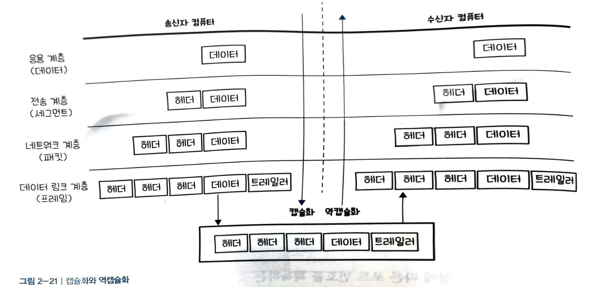

# 네트워크 통신을 위한 약속
## 네트워크의 규칙, 프로토콜
사람과 사람간 형식적인 인사를 할 때도 언어 체계가 필요하듯이 컴퓨터와 컴퓨터가 통신할 때도 마찬가지이다. 컴퓨터 세계에서 나누는 이러한 형식적으로 나누는 인사 과정을 **프로토콜**이라고 한다.

이것을 보다 IT적인 표현으로 바꾸면
> 컴퓨터나 원거리 통신 장비 사이에서 메시지를 주고받는 양식과 규칙의 체계

대표적인 프로토콜은 `OSI 7계층`과 `TCP/IP 4계층`이 있다.

## OSI 7계층과 TCP/IP 4계층
ISO에서는 네트워크에 대해서 표준을 정의했는데 대표적인 것이 `OSI 7계층`이다.

### OSI 7계층
**OSI 7계층은 컴퓨터와 컴퓨터가 통신하는 구조를 7계층으로 정의해둔 약속, 즉 프로토콜이다.**

|계층 |설명 |
|------|------|----|
|7계층 응용 계층|사용자와 애플리케이션간의 소통|
|6계층 표현 계층|데이터를 어떻게 표현할지 정의|
|5계층 세션 계층|통신을 설정,관리,종료|
|4계층 전송 계층|신뢰성 있는 정확한 데이터 전달|
|3계층 네트워크 계층|네트워크 장치간의 경로 선택과 데이터 전송|
|2계층 데이터 링크 계층|물리적인 연결을 통해 오류없는 데이터 전달|
|1계층 물리 계층|전기 신호를 이용해서 통신 케이블로 데이터를 전송|

### TCP/IP 4계층
컴퓨터 간 통신을 위한 표준이 OSI 7계층이었다면 이 이론을 기반으로 만들어진 인터넷 표준이 OSI 계층을 합쳐서 4개의 계층으로 줄인 것이 `TCP/IP 4계층`이다. 

|계층 |설명 |
|---|------------------|
|4계층 응용 계층|사용자와 애플리케이션간의 소통|
|3계층 전송 계층|데이터를 전송과 흐름에 있어 신뢰성 보장|
|2계층 인터넷 계층|물리적으로 데이터가 네트워크를 통해 어떻게 전송되는지를 정의|
|1계층 네트워크 인터페이스 계층|데이터를 전기 신호로 변환한 뒤 데이터 전송|

## OSI 7계층에서의 데이터 표현
계층마다 데이터를 부르는 용어가 다르다. 
-  **응용 계층부터 세션 계층**까지 사용하는 전송 단위를 `데이터` 혹은 `메시지`라고 부른다.
- **전송 계층**에서는 `세그먼트`
-  **네트워크 계층**에서는 `패킷` 
-  **데이터링크 계층**에서는 `프레임`
- **물리 계층**에서는 `비트`

또한 각각의 데이터에 포함된 내용은 다음과 같다. 한 단계씩 아래로 내려가면서 통신을 위한 정보가 하나씩 추가로 붙게 된다.
- **데이터**에는 말 그대로 데이터가 담겨 있다. 예를 들어 이메일을 보낸다고 하면 이메일의 본문이 데이터가 된다.
- **세그먼트**에서는 `포트 번호`, **패킷**에서는 `송 수신자의 IP 주소`, **프레임**에서는 `송 수신자의 MAC주소`가 붙게 된다.

`포트 번호`란 **애플리케이션을 구분하기위한 번호**이다.
> 우리가 구글에 접속해도 검색을 할 수도 있고, 이메일을 보낼 수도 있다. 목적에 따라 사용하는 응용 프로그램이 다른데 이 때 구분을 포트번호로 한다. (ex) 검색의 포트번호는 80번, 이메일은 25번)

`IP주소`는 인터넷에 연결되어 있는 모든 장치를 식별할 수 있도록 **각각의 장치에 부여된 고유 주소**이고, 다른 장치와 중복될 수 없다.

`MAC 주소`는 **하드웨어 장치에 할당된 주소**이다.

`IP주소`는 **인터넷 서비스에 가입하면 할당받는 주소**이고, **네트워크 계층**에서 사용되지만, `MAC 주소`는 **컴퓨터를 구매할 때부터 할당되어 있는 기기의 고유 번호**이며 **데이터 링크 계층**에 사용된다. 

## 캡슐화와 역캡슐화

OSI 7계층을 지나면서 정보가 하나씩 덧붙여지는데 이와 같이 **각 계층을 지나면서 덧붙여지는 정보**를 `헤더`라고 한다.

### 캡슐화
`캡슐화`는 **계층에 따라 이러한 정보를 담은 헤더를 데이터에 붙여나가는 과정을 의미**한다.
|계층|헤더 정보|
|--|--|
|전송 계층|포트 정보|
|네트워크 계층|송수신자의 IP정보|
|데이터 링크 계층|송수신자의 MAC 주소, 트레일러|

`트레일러`는 **전달한 데이터에 오류가 없는지 검출하기 위한 용도**로 사용된다.

### 역 캡슐화
캡슐화가 계층을 지나면서 헤더 정보가 추가되는 것이라면, **반대로 `역 캡슐화`는 헤더 정보가 하나씩 벗겨지는 것을 말한다.**

**데이터링크 계층**에서 **MAC주소를 획득**하고, **네트워크 계층**에서 **IP주소**를, **전송 계층**에서는 **응용프로그램의 특성에 따른 포트정보를 획득**한다.

## VPN

VPN은 **인터넷을 통해 데이터를 안전하게 전송하기 위한 기술**이다.
- VPN 클라이언트 소프트웨어 설치: 먼저 컴퓨터에 VPN 클라이언트 소프트웨어를 설치해야한다.
- VPN 서버연결 및 인증: VPN 클라이언트 소프트웨어를 사용하여 VPN 서버에 연결한다. 이 때 사용자 이름과 암호를 사용하여 인증한다.
- 데이터 암호화: VPN연결이 설정되면 **모든 데이터는 암호화되어 전송**된다.
- 터널링: 암호화된 데이터를 전송하기 위해 `터널링 기술`을 사용한다. `터널링`이란 **각 네트워크 간에 마치 터널이 뚫린 것처럼 네트워크 사이에 통로를 생성하는 것**을 말한다.

VPN은 IPSec VPN과 SSL VPN 2가지 종류가 있다.
| 구분 | IPSec Vpn | SSL VPN |
|--|--|--|
|OSI 7계층 | 3계층| 4~7계층|
|암호화|IP 패킷 암호화| 데이터 암호화|
|접속 방법|소프트웨어를 설치하여 접속|웹 브라우저에서 접속|

## 핵심 용어 정리

- **프로토콜**: 컴퓨터나 원거리 통신 장비끼리 통신하기 위한 규약
- **OSI 7계층**: ISO에서 정의한 컴퓨터 간 통신하는 구조를 7계층으로 정의한 약속, 즉, 프로토콜이다.
- **TCP/IP 4계층**: OSI 7계층을 바탕으로 만들어진 인터넷 표준 
- **캡슐화**: 각 계층마다 헤더 정보를 추가해나가는 과정
- **역 캡슐화**:  데이터에서 헤더 정보를 하나씩 분리해나가는 과정
- **트레일러**: 데이터를 전달할 때 마지막에 추가하는 정보로서 데이터의 오류를 검출하기 위한 용도이다.
- ** VPN**: 데이터를 암호화하여 안전하게 통신하는 기술로 터널링 기술 사용한다.
