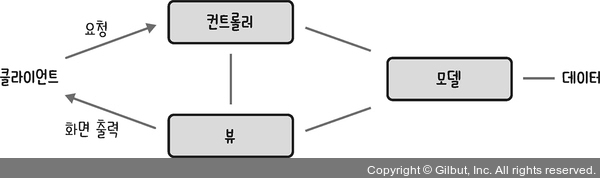

# MVC 패턴과 MVP 패턴, MVVM 패턴
## MVC패턴
`MVC` 는 Model, View, Controller의 약자 이고, 하나의 애플리케이션, 프로젝트를 구성할 때 그 구성요소를 세가지의 역할로 구분한 패턴이다.

- 모델, 뷰, 컨트롤러가 별도의 컴포넌트로 분리되어 있어 서로에게 영향을 받지 않고 작업을 수행한다.
 - 재사용성과 확장성이 용이한 장점이 있다.
 -  `모델`과 `뷰`의 관계가 복잡해지는(둘 사이 의존성이 높다 라는) 단점이 있다.

### 모델
`모델`은 **핵심 기능과 데이터**를 가지고 있는 객체이다. 즉, 애플리케이션의 데이터인 데이터베이스, 상수, 변수 등을 뜻한다. 

데이터에 변경이 일어나면 변경사항을 발산해야하며, `모델`에서 **직접 뷰를 참조해서 수정하게 되는 구조를 가지면 안된다**. 

`뷰`에서 데이터를 생성하거나 수정하면 `컨트롤러`를 통해 모델을 생성하거나 갱신해야 한다.

### 뷰
`뷰`는 inputbox, checkbox, textarea 등 사용자에게 표시되는 정보로 UI같은 시각적 인터페이스 요소, 즉 **모델을 기반으로 사용자가 볼 수 있는 화면**을 말한다. 

`모델`이 갖고 오는 데이터를 저장하면 안되며, **단지 받아온 데이터를 화면에 표시하는 역할만 하는 것이다.**

### 컨트롤러
사용자로 받은 입력을 처리해 하나 이상의 **모델과 하나 이상의 뷰를 잇는 다리 역할**을 하며 이벤트 등 **메인 로직을 담당**한다. 

모델과 뷰는 서로의 존재를 모르고 변경 사항만 수신/발신 하지만, **컨트롤러는 그들에 대해 알고 있어야 하고 이를 통지해 주어야 한다.**
`컨트롤러`는 여러개의 `뷰`를 선택할 수 있다.

### 동작 순서
-   사용자의 `입력`들은 `컨트롤러`에 들어오게 됩니다.
-   `컨트롤러`는 사용자의 `입력`를 확인하고, `모델`을 업데이트합니다.
-   `컨트롤러`는 `모델`을 나타내줄 `뷰`를 선택합니다.
-   `뷰`는 `모델`을 이용하여 화면을 나타냅니다.

출처: [https://beomy.tistory.com/43](https://beomy.tistory.com/43) [beomy:티스토리]


### 예시
MVC패턴을 이용한 대표적인 라이브러리는 리액트가 있다.

리액트는 유저 인터페이스를 구축하기 위한 라이브러리로 `가상 DOM`을 통해 실제 DOM을 조작하는 것을 추상화해서 성능을 높였다.

대표적인 특성으로는 `불변성` 이 있다. 예를 들어 state는 setState를 통해서만 수정이 가능하고, props를 기반으로 해서 만들어지는 컴포넌트인 pureComponent가 있다.

## MVP패턴과 MVVM패턴

### MVP패턴
MVC패턴으로부터 파생되었으며 MVC에서 C에 해당하는 `컨트롤러(Controller)`가 `프레젠터(presenter)`로 교체된 패턴이다.
- `프레젠터`는 `뷰`와 `모델`의 인스턴스를 가지고 있어 둘을 연결하는 접착제 역할을 한다.
- `프레젠터`와 `뷰`는 1:1 관계이다.
- `뷰`와 `모델`의 의존성이 없다 라는 장점이 있다.(MVC패턴을 개선)
- 어플리케이션이 복잡해 질 수록 `뷰`와 `프레젠터` 사이의 의존성이 강해지는 단점이 있다.

### MVVM 패턴
MVVM 패턴은 MVC의 C에 해당하는 컨트롤러가 `뷰모델`(View Model)로 바뀐 패턴이다.

여기서 `뷰모델`은 **뷰를 더 추상화한 계층**이며, `MVVM패턴`은 `MVC패턴`과는 다르게 **커맨드와 데이터 바인딩을 가지는 것이 특징**이다.

- `뷰`와 `뷰모델`사이의 `양방향 데이터 바인딩`을 지원한다.
-  UI를 별도의 코드 수정 없이 재사용할 수 있고 단위테스팅 하기 쉽다라는 장점이 있다. 
-  `뷰모델`의 설계가 쉽지 않다 라는 단점도 있다.

```
- 커맨드
여러 가지 요소에 대한 처리를 하나의 액션으로 처리할 수 있게 하는 기법이다.

- 데이터 바인딩
화면에 보이는 데이터와 웹 브라우저의 메모리 데이터를 일치시키는 기법으로, 뷰모델을 변경하면 뷰가 된다.
```
MVVM 패턴의 대표적인 예는 뷰(Vue.js)가 있다.